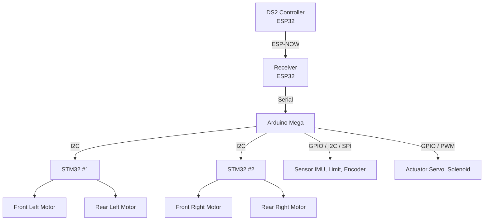

# 🤖 RI-SETAN LX25  

### LX25 PROGRAMMING RESEARCH AND DEVELOPMENT

---

## 📘 Dokumentasi Riset Program LX24

🔗 **Repository Referensi LX24**  
https://github.com/HabibMuhammad05/KRAI-ESPNOW-DS2-CONTROLLER-PROJECT  

**Deskripsi Singkat:**
- DS2 Controller menggunakan **ESP32**
- Komunikasi wireless berbasis **ESP-NOW**
- Mendukung fitur lengkap **Transmitter & Receiver**
- Digunakan pada **R1 & R2 Abu Robocon 2025**
- Riset **PID Control Motor PG45** menggunakan **internal encoder**

---

## 📙 Dokumentasi Riset Program LX25

🔗 **Repository Utama LX25**  
https://github.com/Irfan-LX25/Ri-Setan-LX25

**Deskripsi & Alur program:**

#### 🔹 R1 – Manual Control (DS2 Controller)

### 📂 Struktur Folder & Penjelasan

- **LX26_R1_JoyStick_Controller_V1.0**  
  Versi awal pengembangan joystick controller sebagai antarmuka utama operator robot.

- **LX26_R1_JoyStick_Controller_V1.1**  
  Penyempurnaan joystick controller dengan optimasi respons, stabilitas input, dan struktur kode.

- **LX26_R2_DualMode_PnP_V1.0**  
  Implementasi sistem **dual-mode Plug & Play** untuk fleksibilitas operasi robot di lapangan.

- **SwerveDrive**  
  Modul pengendalian **swerve drive** untuk robot omni-directional dengan kontrol arah dan kecepatan.

- **Tuning_PID_DC_MOTOR**  
  Riset dan pengujian **PID control motor DC** menggunakan feedback encoder untuk mendapatkan respon optimal.

Repositori ini digunakan sebagai **basis riset internal dan pengembangan lanjutan** sistem LX25.
