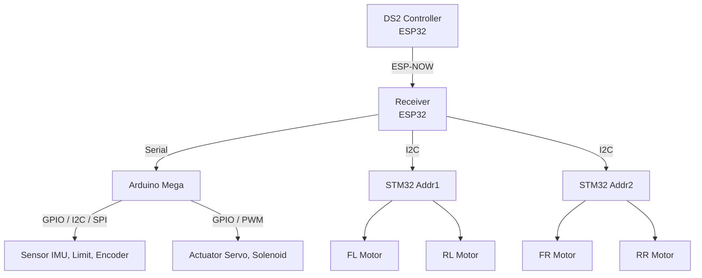
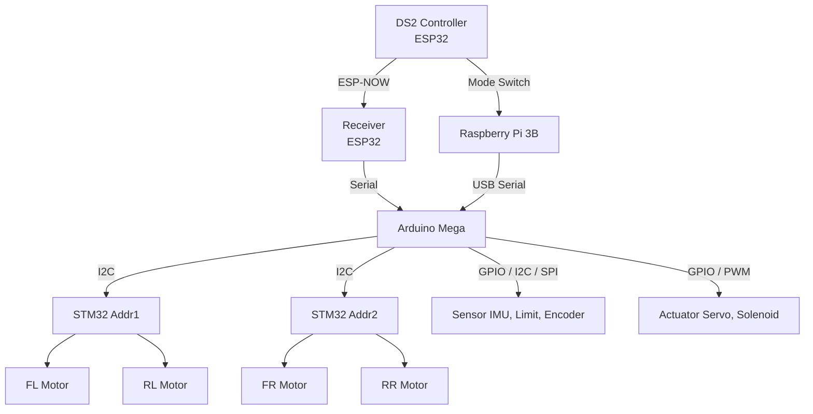
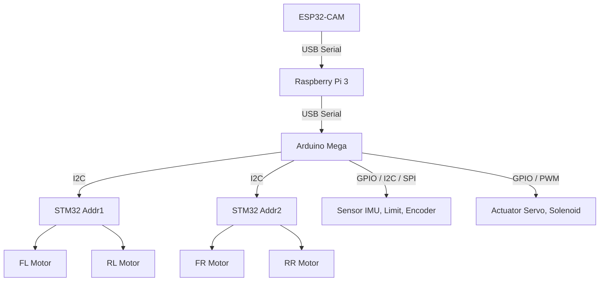

# 🤖 RI-SETAN LX25  

### LX25 PROGRAMMING RESEARCH AND DEVELOPMENT

---

## 📘 Dokumentasi Riset Program LX24

🔗 **Repository Referensi LX24**  
https://github.com/HabibMuhammad05/KRAI-ESPNOW-DS2-CONTROLLER-PROJECT  

**Deskripsi Singkat:**
- DS2 Controller menggunakan **ESP32**
- Komunikasi wireless berbasis **ESP-NOW**
- Mendukung fitur lengkap **Transmitter & Receiver**
- Digunakan pada **R1 & R2 Abu Robocon 2025**
- Riset **PID Control Motor PG45** menggunakan **internal encoder**

---

## 📙 Dokumentasi Riset Program LX25

🔗 **Repository Utama LX25**  
https://github.com/Irfan-LX25/Ri-Setan-LX25

**Deskripsi & Alur program :**

#### 🔹 R1 – Manual Control (DS2 Controller ESP-NOW)

### 📂 Struktur Folder & Penjelasan

- **LX26_R1_JoyStick_Controller_V1.0**  
  Versi awal dengan Mega sebagai Master I2C STM32 Slave

- **LX26_R1_JoyStick_Controller_V1.1**  
  Revisi dengan ESP32 RX sebagai Master I2C STM32 Slve

#### 🔹 R2 – DualMode PnP (Manual ↔ Autonomous)

### 📂 Struktur Folder & Penjelasan

- **LX26_R1_JoyStick_Controller_V1.0**  
  Versi awal pengembangan joystick controller sebagai antarmuka utama operator robot.

- **LX26_R1_JoyStick_Controller_V1.1**  
  Penyempurnaan joystick controller dengan optimasi respons, stabilitas input, dan struktur kode.

#### 🔹 R2 – Autonomous PnP

### 📂 Struktur Folder & Penjelasan

- **LX26_R1_JoyStick_Controller_V1.0**  
  Versi awal pengembangan joystick controller sebagai antarmuka utama operator robot.

- **LX26_R1_JoyStick_Controller_V1.1**  
  Penyempurnaan joystick controller dengan optimasi respons, stabilitas input, dan struktur kode.

Repositori ini digunakan sebagai **basis riset internal dan pengembangan lanjutan** sistem LX25.
