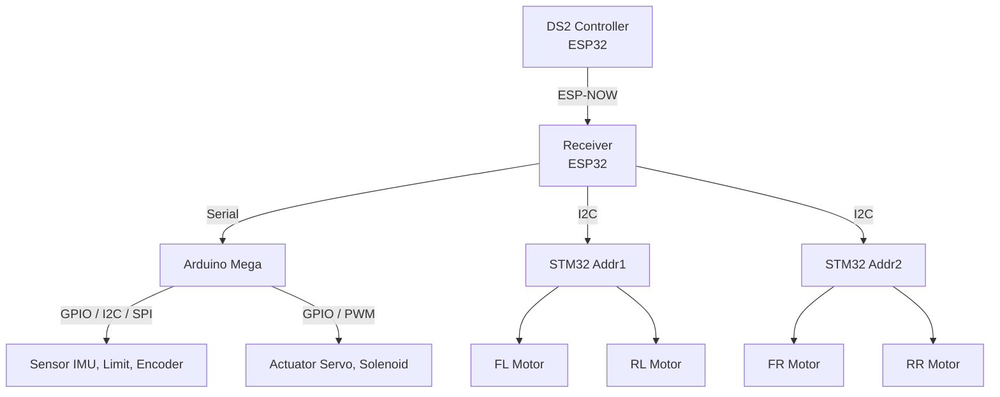
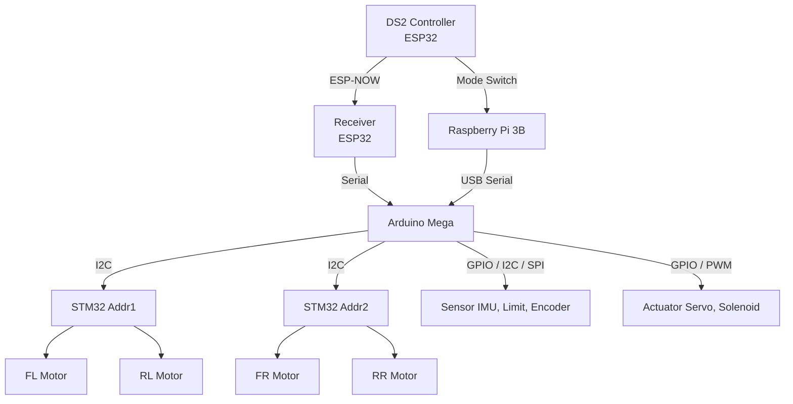
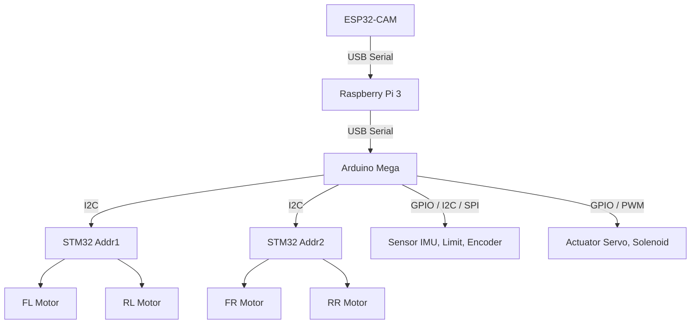

# 🤖 RI-SETAN LX25  

### LX25 PROGRAMMING RESEARCH AND DEVELOPMENT

---

## 📘 Dokumentasi Riset Program LX24

🔗 **Repository Referensi LX24**  
https://github.com/HabibMuhammad05/KRAI-ESPNOW-DS2-CONTROLLER-PROJECT  

**Deskripsi Singkat:**
- DS2 Controller menggunakan **ESP32**
- Komunikasi wireless berbasis **ESP-NOW**
- Mendukung fitur lengkap **Transmitter & Receiver**
- Digunakan pada **R1 & R2 Abu Robocon 2025**
- Riset **PID Control Motor PG45** menggunakan **internal encoder**

---

## 📙 Dokumentasi Riset Program LX25

🔗 **Repository Utama LX25**  
https://github.com/Irfan-LX25/Ri-Setan-LX25

**Deskripsi & Alur program :**

#### 🔹 R1 – Manual Control (DS2 Controller ESP-NOW)

### 📂 Struktur Folder & Penjelasan

- **LX26_R1_JoyStick_Controller_V1.0**  
  Versi awal dengan Mega sebagai Master I2C STM32 Slave

- **LX26_R1_JoyStick_Controller_V1.1**  
  Revisi dengan ESP32 RX sebagai Master I2C STM32 Slve

#### 🔹 R2 – DualMode PnP (Manual ↔ Autonomous)

### 📂 Struktur Folder & Penjelasan

#### 🔹 R2 – Autonomous PnP

### 📂 Struktur Folder & Penjelasan

---

## PINOUT
**Motor 1 (FL di Slave 1, RL di Slave 2) steerinG**
- #define MOTOR1_PWMA PA_6
- #define MOTOR1_PWMB PA_7
- #define ENC1_A PB_7   // Timer 2 Channel 1
- #define ENC1_B PB_6  // Timer 2 Channel 2

**Motor 2 (FR di Slave 1, RR di Slave 2) manuver**
- #define MOTOR2_PWMA PA_1
-  #define MOTOR2_PWMB PA_3
- #define ENC2_A PB_9   // Timer 3 Channel 1
- #define ENC2_B PB_8   // Timer 3 Channel 2

---
<table width="100%" cellspacing="0" cellpadding="6" border="1"> <tr> <td width="50%"> <table width="100%" cellspacing="0" cellpadding="6" border="1"> <tr style="background-color:#70AD47; color:white; font-weight:bold; text-align:center;"> <td colspan="4">Motor DC FR</td> </tr> <tr style="background-color:#A9D08E; font-weight:bold;"> <td>Parameter</td><td>Simbol</td><td>Satuan</td><td>Nilai</td> </tr> <tr><td>Resolusi Encoder</td><td>PPR</td><td>Pulses</td><td></td></tr> <tr><td>PWM Deadzone (Maju)</td><td>MinPWM+</td><td>0-255</td><td></td></tr> <tr><td>PWM Deadzone (Mundur)</td><td>MinPWM-</td><td>0-255</td><td></td></tr> <tr><td>Max Speed (Raw)</td><td>MaxTick</td><td>Ticks/20ms</td><td></td></tr> <tr><td>Max Speed (Real)</td><td>MaxRPM</td><td>RPM</td><td></td></tr> <tr><td>Proportional</td><td>Kp</td><td>Konstanta</td><td></td></tr> <tr><td>Integral</td><td>Ki</td><td>Konstanta</td><td></td></tr> <tr><td>Derivative</td><td>Kd</td><td>Konstanta</td><td></td></tr> <tr><td>Arah Terbalik?</td><td>Dir_Inv</td><td>True/False</td><td></td></tr> <tr><td>Filter Encoder</td><td>Alpha</td><td>Konstanta</td><td></td></tr> </table> </td> <td width="50%"> <table width="100%" cellspacing="0" cellpadding="6" border="1"> <tr style="background-color:#70AD47; color:white; font-weight:bold; text-align:center;"> <td colspan="4">Motor DC FL</td> </tr> <tr style="background-color:#A9D08E; font-weight:bold;"> <td>Parameter</td><td>Simbol</td><td>Satuan</td><td>Nilai</td> </tr> <tr><td>Resolusi Encoder</td><td>PPR</td><td>Pulses</td><td></td></tr> <tr><td>PWM Deadzone (Maju)</td><td>MinPWM+</td><td>0-255</td><td></td></tr> <tr><td>PWM Deadzone (Mundur)</td><td>MinPWM-</td><td>0-255</td><td></td></tr> <tr><td>Max Speed (Raw)</td><td>MaxTick</td><td>Ticks/20ms</td><td></td></tr> <tr><td>Max Speed (Real)</td><td>MaxRPM</td><td>RPM</td><td></td></tr> <tr><td>Proportional</td><td>Kp</td><td>Konstanta</td><td></td></tr> <tr><td>Integral</td><td>Ki</td><td>Konstanta</td><td></td></tr> <tr><td>Derivative</td><td>Kd</td><td>Konstanta</td><td></td></tr> <tr><td>Arah Terbalik?</td><td>Dir_Inv</td><td>True/False</td><td></td></tr> <tr><td>Filter Encoder</td><td>Alpha</td><td>Konstanta</td><td></td></tr> </table> </td> </tr> </table>
<table width="100%" cellspacing="0" cellpadding="6" border="1"> <tr> <td width="50%"> <table width="100%" cellspacing="0" cellpadding="6" border="1"> <tr style="background-color:#70AD47; color:white; font-weight:bold; text-align:center;"> <td colspan="4">Motor DC RR</td> </tr> <tr style="background-color:#A9D08E; font-weight:bold;"> <td>Parameter</td><td>Simbol</td><td>Satuan</td><td>Nilai</td> </tr> <tr><td>Resolusi Encoder</td><td>PPR</td><td>Pulses</td><td></td></tr> <tr><td>PWM Deadzone (Maju)</td><td>MinPWM+</td><td>0-255</td><td></td></tr> <tr><td>PWM Deadzone (Mundur)</td><td>MinPWM-</td><td>0-255</td><td></td></tr> <tr><td>Max Speed (Raw)</td><td>MaxTick</td><td>Ticks/20ms</td><td></td></tr> <tr><td>Max Speed (Real)</td><td>MaxRPM</td><td>RPM</td><td></td></tr> <tr><td>Proportional</td><td>Kp</td><td>Konstanta</td><td></td></tr> <tr><td>Integral</td><td>Ki</td><td>Konstanta</td><td></td></tr> <tr><td>Derivative</td><td>Kd</td><td>Konstanta</td><td></td></tr> <tr><td>Arah Terbalik?</td><td>Dir_Inv</td><td>True/False</td><td></td></tr> <tr><td>Filter Encoder</td><td>Alpha</td><td>Konstanta</td><td></td></tr> </table> </td> <td width="50%"> <table width="100%" cellspacing="0" cellpadding="6" border="1"> <tr style="background-color:#70AD47; color:white; font-weight:bold; text-align:center;"> <td colspan="4">Motor DC RL</td> </tr> <tr style="background-color:#A9D08E; font-weight:bold;"> <td>Parameter</td><td>Simbol</td><td>Satuan</td><td>Nilai</td> </tr> <tr><td>Resolusi Encoder</td><td>PPR</td><td>Pulses</td><td></td></tr> <tr><td>PWM Deadzone (Maju)</td><td>MinPWM+</td><td>0-255</td><td></td></tr> <tr><td>PWM Deadzone (Mundur)</td><td>MinPWM-</td><td>0-255</td><td></td></tr> <tr><td>Max Speed (Raw)</td><td>MaxTick</td><td>Ticks/20ms</td><td></td></tr> <tr><td>Max Speed (Real)</td><td>MaxRPM</td><td>RPM</td><td></td></tr> <tr><td>Proportional</td><td>Kp</td><td>Konstanta</td><td></td></tr> <tr><td>Integral</td><td>Ki</td><td>Konstanta</td><td></td></tr> <tr><td>Derivative</td><td>Kd</td><td>Konstanta</td><td></td></tr> <tr><td>Arah Terbalik?</td><td>Dir_Inv</td><td>True/False</td><td></td></tr> <tr><td>Filter Encoder</td><td>Alpha</td><td>Konstanta</td><td></td></tr> </table> </td> </tr> </table>
